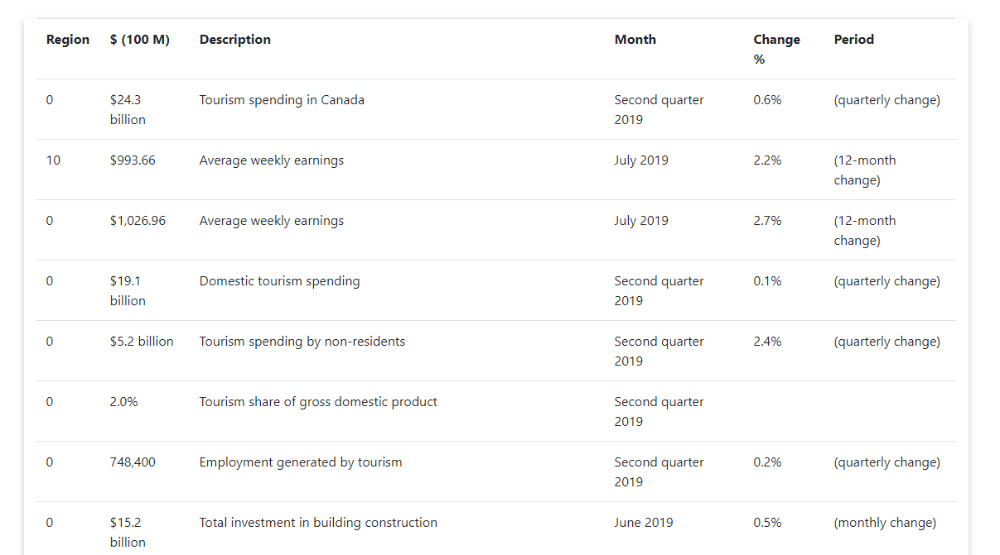

## Personal Financial Databoard

This is shallow copy of the finance dashboard I use to track my investments and other stocks of interest.

All the data has been mutated and shifted around, but is still an excellent starting point for more advanced usages of plotly dash.

This application is primarily focussed on Canadian data and can scrap data from TD and RBC banks.

Since TD and RBC are useful PWA's there is no good alternative (let me know if there is) but to have selenium based scrapping solutions.

### Installation

Ensure that you either have a google cloud platform account which serverless functions or selenium installed + (chromedriver)[https://chromedriver.chromium.org/].

```
pip install
```

For local usage, use python run.py



